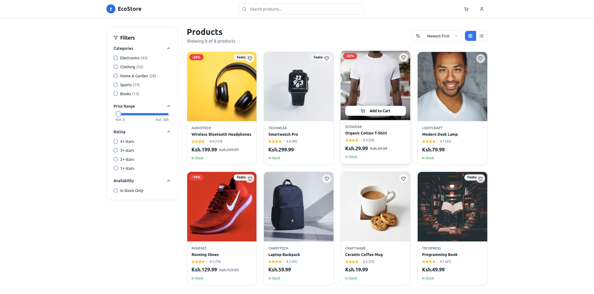

# EcoStore  

 
      
    

EcoStore is a **modern e-commerce product catalog frontend** built with **React, TypeScript, Tailwind CSS, and Zustand**.  
It simulates a **real-world online store** where users can browse, filter, and sort products seamlessly, while also providing **authentication and protected routes**.  

This project emphasizes **scalable frontend architecture**, **responsive UI/UX**, and **clean state management**, making it ideal for learning or extending into a full production app.  

---


## Demo  

### Login Page  
  

### Product Catalog  
  

### Responsive View  
  


## Features  

### Authentication  
- User login, registration, and logout.  
- Zustand store manages user state (token + user info).  
- Protected routes: only authenticated users can access the catalog.  

### Product Catalog  
- **Dynamic product list** with mock API integration (easy to swap with real API).  
- **Filtering:** by category and price range.  
- **Sorting:** by price (low → high, high → low) and alphabetically (A–Z, Z–A).  
- **Pagination & Infinite Scrolling:** supports both numbered navigation and “load more on scroll.”  
- **Responsive design:** works across desktop, tablet, and mobile.  
- **Error handling & loaders:** skeleton states and fallback messages.  

### ⚡ State Management (Zustand)  
- **Auth slice:** manages user and session.  
- **Product slice:** manages products, filters, sorting, and pagination state.  
- Type-safe with **TypeScript interfaces** for maintainability.  

---

## Tech Stack  

- **React + TypeScript** → Component-based frontend  
- **Tailwind CSS** → Modern, responsive styling  
- **Zustand** → Lightweight global state management  
- **React Router** → Navigation & protected routes  
- **Mock API layer** → Easy swap-in for real backend  

---

## Project Structure  

```plaintext
EcoStore/
├── src/
│   ├── App.css
|   ├── App.tsx
|   ├── components
|    │   ├── auth
|    │   │   └── ProtectedRoute.tsx
|    │   ├── layout
|    │   │   └── Navbar.tsx
|    │   ├── products
|    │   │   ├── ProductCard.tsx
|    │   │   └── ProductFilters.tsx
|    │   └── ui/...
|    ├── hooks # custom hooks
|    │   ├── use-mobile.tsx
|    │   └── use-toast.ts
|    ├── index.css
|    ├── lib
|    │   ├── api
|    │   │   ├── auth.ts
|    │   │   └── products.ts
|    │   └── utils.ts
|    ├── main.tsx
|    ├── pages
|    │   ├── Cart.tsx
|    │   ├── CheckOut.tsx
|    │   ├── Home.tsx
|    │   ├── Login.tsx
|    │   ├── NotFound.tsx
|    │   ├── Products.tsx
|    │   └── Register.tsx
|    ├── stores # Zustand store
|    │   ├── authStore.ts
|    │   ├── cartStore.ts
|    │   └── productsStore.ts
|    ├── types
|    │   └── index.ts
|    └── vite-env.d.ts
├── Learning.md # ALX README
├── README.md # Project README

```
##  Getting Started
1. Clone the Repository

    ```$ git clone https://github.com/G-Okumu/alx-project-nexus.git```

    ```$ cd ecostore ```

2. Install Dependencies

    ```$ npm install```

3. Run the Development Server

    ```$ npm run dev```


App will be available at: ``http://localhost:8080/``

## Future Improvements

- Real Backend API integration
- PayPal Mpesa payment
- Admin dashboard for product management
- Maaaaybe** PWA support

## LICENSE
- This project is open-source and available under the MIT License.
